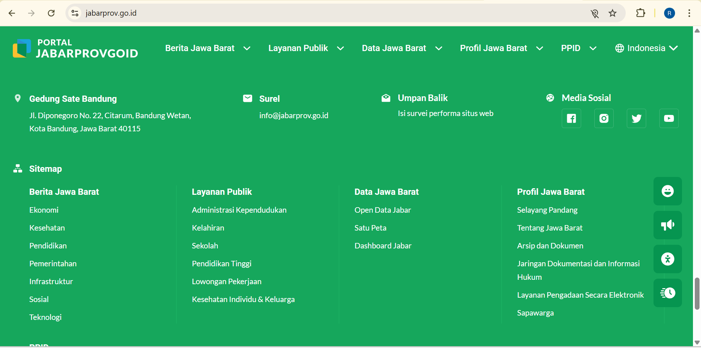
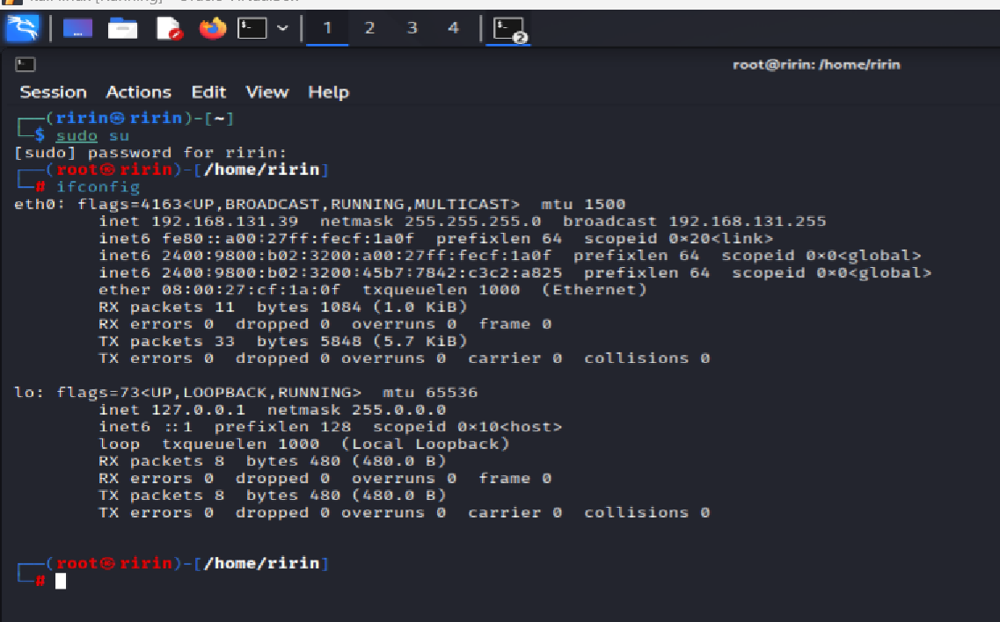
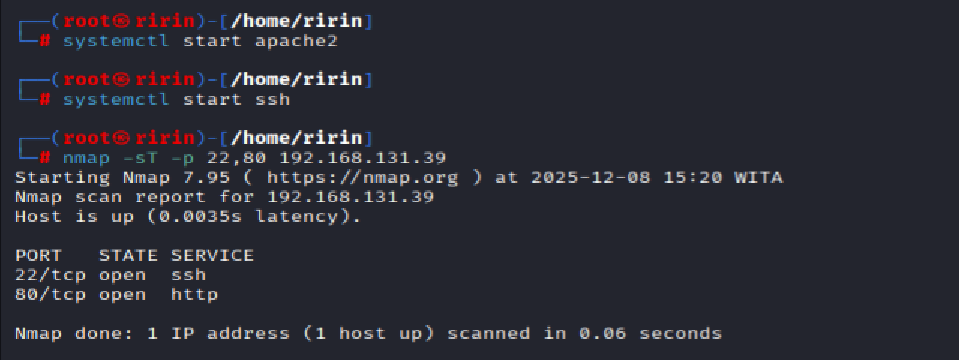

# Penetration Testing Final Project: Security Assessment Report

**Author:** Ririn Yulandari
**Date:** December 2025
**Tools:** Kali Linux, Nmap, Wireshark, Google Dorks

---

## 📄 Project Overview
Repository ini berisi **Laporan Teknis Security Assessment** yang disusun sebagai Tugas Besar mata kuliah Keamanan Siber. Proyek ini mensimulasikan proses audit keamanan yang terbagi menjadi dua tahapan utama:
1.  **Passive Reconnaissance (OSINT):** Pengumpulan informasi publik tanpa interaksi langsung.
2.  **Active Reconnaissance (Lab Simulation):** Analisis protokol jaringan dan pemindaian port dalam lingkungan terkontrol.

## 🎯 Scope & Targets
Proyek ini dilakukan dengan batasan etika yang ketat (*Ethical Hacking*):

| Type | Target | Description |
| :--- | :--- | :--- |
| **Passive Recon** | `jabarprov.go.id` | Pemerintah Provinsi Jawa Barat (Analisis Jejak Digital Publik) |
| **Active Recon** | `Localhost / 192.168.131.39` | Laboratorium Lokal (Analisis Paket & Port Scanning) |

---

## 🛠️ Methodology & Findings

### 1. Passive Reconnaissance (Information Disclosure)
Menggunakan teknik **Google Dorking** dan **GitHub Recon** untuk mencari kebocoran data sensitif (seperti file `.sql`, `.env`, atau kredensial).

* **Tools:** Google Search Operators, GitHub Search.
* **Result:** Target memiliki tingkat keamanan (*Digital Hygiene*) yang sangat baik. Tidak ditemukan file konfigurasi, backup database, atau kredensial yang terekspos secara publik. Konfigurasi `robots.txt` efektif mencegah pengindeksan data sensitif.

### 2. Active Reconnaissance (Network Protocol Analysis)
Melakukan simulasi serangan **TCP Connect Scan** menggunakan Nmap sembari memantau lalu lintas jaringan menggunakan Wireshark untuk memahami perilaku protokol TCP/IP.

* **Tools:** Nmap (`-sT`), Wireshark (`loopback` interface).
* **Analysis:**
    * **Open Port (Scenario: SSH & HTTP Active):** Wireshark menangkap proses **3-Way Handshake** lengkap (`SYN` → `SYN-ACK` → `ACK`).
    * **Closed Port (Scenario: Services Stopped):** Wireshark menangkap respons penolakan koneksi berupa paket **RST, ACK** (Reset) dari server.

## 📸 Bukti Dokumentasi (Evidence)

Berikut adalah dokumentasi langkah-langkah pengerjaan:

### 1. Passive Reconnaissance (Target: Jabarprov)
Analisis jejak digital menggunakan metode OSINT.

| Google Dorking | GitHub Recon | Pencarian Karyawan/Email |
| :---: | :---: | :---: |
|  |  |  |
| *Pencarian File Sensitif* | *Pencarian Repositori* | *Enumerasi Data Publik* |

### 2. Active Reconnaissance (Target: Localhost)
Simulasi pemindaian port dan analisis paket jaringan.

| Nmap Scan (Open Port) | Nmap Scan (Closed Port) | Wireshark (Handshake) |
| :---: | :---: | :---: |
|  |  |  |
| *Hasil Scan Layanan Aktif* | *Hasil Scan Layanan Mati* | *Analisis TCP 3-Way Handshake* |

---

## 📂 File Structure
* `LAPORAN_Ririn_Yulandari.pdf`: Dokumen laporan lengkap berisi metodologi, bukti screenshot, dan analisis mendalam.
* `README.md`: Ringkasan eksekutif proyek ini.
* `evidence/` : Folder berisi gambar dokumentasi langkah-langkah pengerjaan.

---

## ⚠️ Disclaimer
*Proyek ini dilakukan semata-mata untuk tujuan pendidikan (Educational Purposes). Penulis tidak bertanggung jawab atas penyalahgunaan informasi atau teknik yang didokumentasikan di sini. Seluruh aktivitas pemindaian aktif dilakukan di lingkungan laboratorium milik sendiri (Localhost).*
